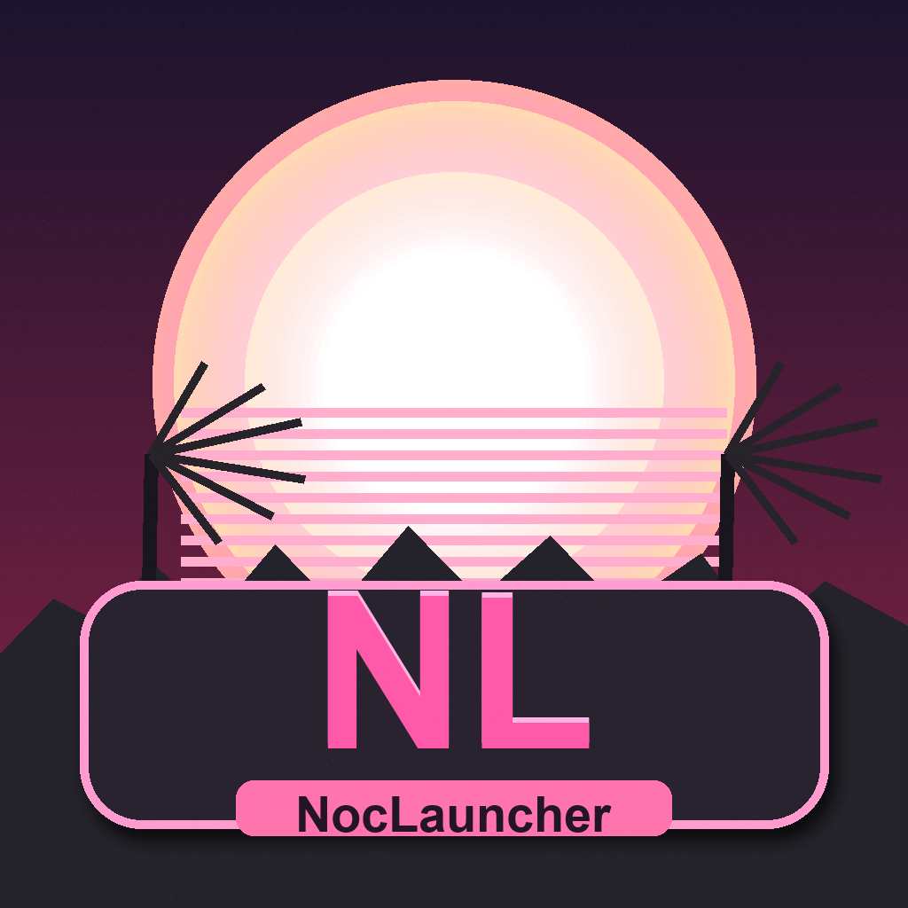

# NocLauncher v1.0.6

<p align="center">
  
</p>

<p align="center">
  <b>🎮 NocLauncher — единый gaming-лаунчер для Minecraft Java + Bedrock</b><br>
  <i>Официальный проект NocCorporation: стабильный запуск, аккуратный UI, диагностика и инструменты в одном месте для всех площадок и всех игроков.</i>
</p>

<p align="center">
  <a href="https://github.com/NocCorporation/NocLauncher/releases/latest">
    
  </a>
  <a href="https://github.com/NocCorporation/NocLauncher/releases/latest">
    
  </a>
  
  
</p>

---

## ✨ Актуальные возможности

- Java + Bedrock в одном лаунчере
- Профили Java: Vanilla / Forge / OptiFine
- Offline-first режим
- Библиотека модов/ресурсов/шейдеров
- Bedrock Hub (mini dock) с быстрыми переключателями
- Внешний FPS-монитор NocFpsCounter (ручной запуск)
- Доп. настройки Bedrock (presets + options.txt)
- MS Fix / Xbox Fixer / Deep Fix
- Проверка и диагностика запуска
- Эксперименты и утилиты

---

## 🆕 Что нового в v1.0.6

- Обновлён общий UI/визуал лаунчера
- Обновлена иконка приложения и иконка Windows-файла (`.ico`)
- Доработаны кнопки выбора Java / Bedrock
- Если Bedrock не установлен — лаунчер сразу открывает Microsoft Store
- Убраны лишние repair/replacement операции, когда Bedrock отсутствует
- Улучшена стабильность запуска и предпролётных проверок

---

## 📦 Скачать

Текущий релиз: **v1.0.6**

- Windows x64: `NocLauncher Setup 1.0.6.exe`

Официальная страница релизов:
<https://github.com/NocCorporation/NocLauncher/releases>

Официальный репозиторий:
<https://github.com/NocCorporation/NocLauncher>

---

## 🛡 Windows Defender / SmartScreen (важно)

Иногда Windows может показывать предупреждение при запуске сборки.
Обычно это связано с тем, что приложение не подписано коммерческим code-sign сертификатом,
а не обязательно с наличием вируса.

Рекомендуется:

1. Скачивать только из официального GitHub Releases.
2. Проверять SHA256 из релиза (`SHA256SUMS-v1.0.6.txt`).
3. При желании дополнительно проверять файл в VirusTotal.

---

## 🔐 Проверка хэша

```powershell
Get-FileHash .\NocLauncher Setup 1.0.6.exe -Algorithm SHA256
```

---

## 🔎 Поисковые запросы (официально)

Чтобы найти именно официальный проект, используйте:

- `NocLauncher GitHub`
- `NocCorporation NocLauncher`
- `NocLauncher Minecraft Java Bedrock`

---

## 🚀 Финал

Спасибо, что выбираете **NocLauncher**.
Если хотите поддержать проект — ставьте ⭐ репозиторию, делитесь ссылкой на официальный релиз и зовите друзей в комьюнити.

**Играй красиво. Играй стабильно. Играй с NocLauncher.**

---

## 📄 Лицензия

MIT (`LICENSE`)
